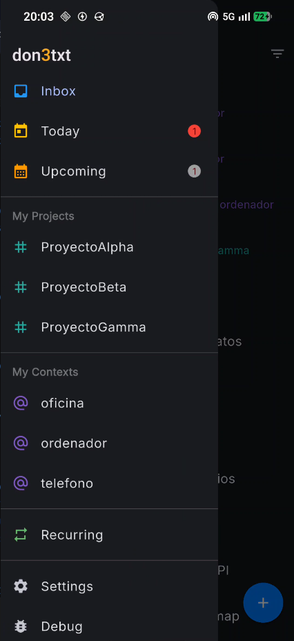
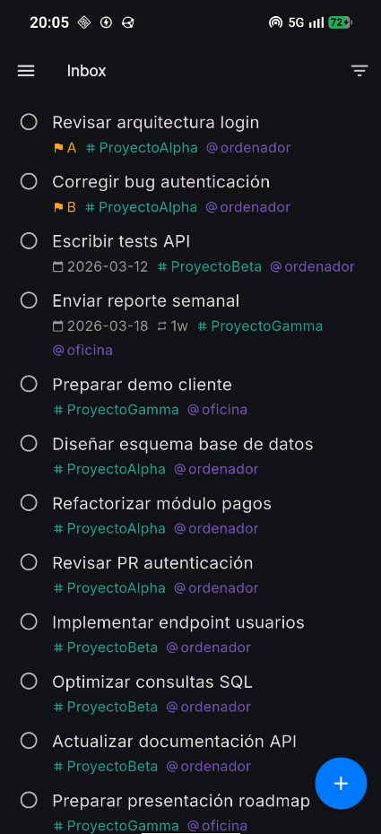
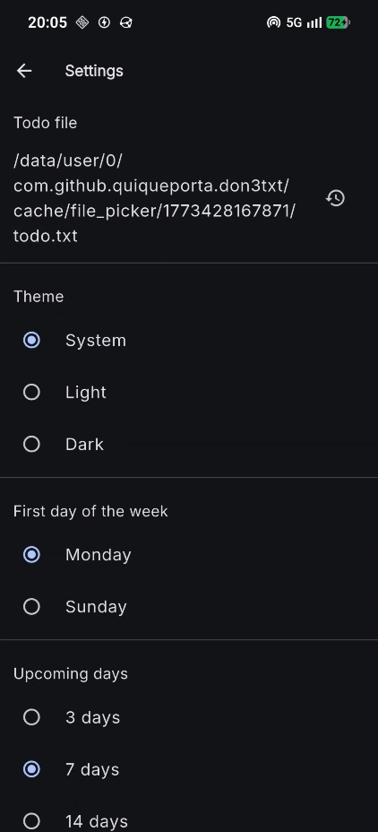

<p align="center">
  
</p>

<h1 align="center">don3txt</h1>

<p align="center">
  <a href="https://github.com/quiqueporta/don3txt/actions/workflows/tests.yml">
    
  </a>
</p>

<p align="center">
  Task manager based on <a href="http://todotxt.org/">todo.txt</a> for Android
  <br>
  <a href="https://quiqueporta.com/don3txt/">quiqueporta.com/don3txt</a>
</p>

---

<p align="center">
  
  &nbsp;&nbsp;&nbsp;
  
  &nbsp;&nbsp;&nbsp;
  
</p>

<p align="center">
  <sub>Sidebar navigation</sub>
  &nbsp;&nbsp;&nbsp;&nbsp;&nbsp;&nbsp;&nbsp;&nbsp;&nbsp;&nbsp;&nbsp;&nbsp;&nbsp;&nbsp;&nbsp;&nbsp;&nbsp;&nbsp;&nbsp;&nbsp;&nbsp;&nbsp;&nbsp;&nbsp;
  <sub>Inbox view</sub>
  &nbsp;&nbsp;&nbsp;&nbsp;&nbsp;&nbsp;&nbsp;&nbsp;&nbsp;&nbsp;&nbsp;&nbsp;&nbsp;&nbsp;&nbsp;&nbsp;&nbsp;&nbsp;&nbsp;&nbsp;&nbsp;&nbsp;&nbsp;&nbsp;
  <sub>Settings screen</sub>
</p>

---

A mobile application for managing tasks based on the [todo.txt](http://todotxt.org/) format, designed for users who prefer plain text, full data ownership, and simple workflows.

## Features

### Task management

- **Create tasks** with automatic parsing of projects (`+name`), contexts (`@name`) and metadata (`key:value`)
- **Complete/uncomplete** tasks with a single tap. The completion date is assigned automatically
- **Priorities** from `(A)` to `(Z)` following the todo.txt standard
- **Creation dates** assigned automatically when a task is created
- **Due dates** (`due:YYYY-MM-DD`) with a built-in calendar picker
- **Threshold dates** (`t:YYYY-MM-DD`) with a calendar picker — tasks with a future threshold date are automatically hidden from all views except Recurring

### Recurring tasks

- **Flexible recurrence**: the next date is calculated from the completion date (e.g. `rec:2w`)
- **Strict recurrence**: the next date is calculated from the original threshold date (`t:`) (e.g. `rec:+2w`). If there is no `t:`, it falls back to flexible recurrence
- Supported units: days (`d`), weeks (`w`), months (`m`), years (`y`)
- Visual picker to configure recurrence when creating a task
- When a recurring task is completed, the next occurrence is created automatically with the new date

### Views and filters

- **Inbox**: shows all pending tasks
- **Today**: shows tasks due today or earlier (overdue), with count badges in the sidebar
- **Upcoming**: shows tasks due from tomorrow up to N days ahead, with a count badge. The period is configurable in settings (3, 7, 14 or 30 days)
- **My Projects**: filters by project (`+name`), generated dynamically from pending tasks
- **My Contexts**: filters by context (`@name`), generated dynamically from pending tasks
- **Recurring**: shows all recurring tasks (with `rec:`), including those with a future threshold date

### File management

- Works with standard plain-text `todo.txt` files
- **Select an existing file** from any location on the device
- **Create a new file** in a custom location
- **Restore** to the default file at any time
- Compatible with synchronisation tools such as **Syncthing**, **Dropbox**, etc.

### Settings

- **Theme**: System (default), Light or Dark — Material Design 3
- **First day of the week**: Monday or Sunday (affects the date picker)
- **Upcoming days**: period for the Upcoming view (3, 7, 14 or 30 days)
- **todo.txt file path**: configurable from settings

## todo.txt format

The app follows the [todo.txt standard](http://todotxt.org/). Examples:

```
Call Mom
(A) Call Mom
(A) 2011-03-02 Call Mom +Family @phone
x 2011-03-03 2011-03-01 Review PR +Project @github
Buy milk due:2024-01-15
Pay rent due:2024-02-01 rec:1m
Review report due:2024-03-01 t:2024-02-25 rec:+1m
```

| Component | Format | Example |
|---|---|---|
| Completion | `x` at the start | `x 2024-01-16 ...` |
| Priority | `(A)` to `(Z)` | `(A) Urgent task` |
| Creation date | `YYYY-MM-DD` | `2024-01-15 Task` |
| Project | `+name` | `+Family` |
| Context | `@name` | `@phone` |
| Due date | `due:YYYY-MM-DD` | `due:2024-01-20` |
| Threshold date | `t:YYYY-MM-DD` | `t:2024-01-18` |
| Recurrence | `rec:[+]Nu` | `rec:2w`, `rec:+1m` |
| Generic metadata | `key:value` | `effort:high` |

## Requirements

- [Flutter](https://docs.flutter.dev/get-started/install) >= 3.9.2
- Android SDK (Android only for now)

## Install dependencies

```bash
flutter pub get
```

## Tests

```bash
flutter test
```

## Build

### Debug (development)

```bash
flutter build apk --debug
```

The APK is generated at `build/app/outputs/flutter-apk/app-debug.apk`.

### Release

```bash
flutter build apk --release
```

The APK is generated at `build/app/outputs/flutter-apk/app-release.apk`.

## Run on emulator or device

```bash
flutter run
```

## Install on a connected device

```bash
flutter install
```

Or directly with `adb`:

```bash
adb install build/app/outputs/flutter-apk/app-release.apk
```

## Project structure

```
lib/
├── main.dart
├── domain/              # Value Objects, Aggregates, pure functions
├── infrastructure/      # Repository: file read/write
├── application/         # Reactive state (ChangeNotifier)
└── ui/                  # Theme, screens and widgets
```
